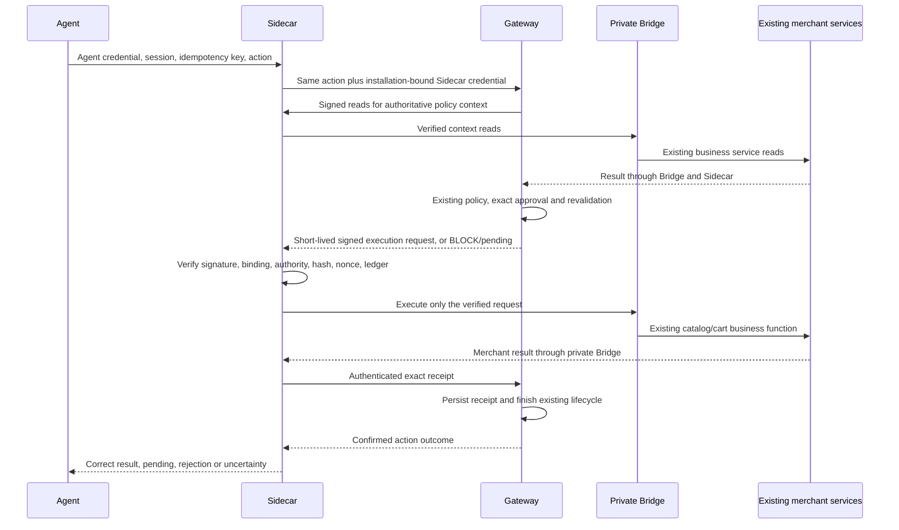

# Auteric MVP state — verified hosted minimum (2026-09-30)

**Ready to run the released Connect candidate for the supported single-host Node ESM/Express integration against `https://control.auteric.com`.** The minimum acceptance passed on a fresh independent merchant repository with real owner PKCE approval. This is not universal customer-store or full production readiness. See `AUTERIC_CONNECT_CLOUD.md` for the released command and explicit hosting prerequisites; `AUTERIC_FULL_READINESS_PROMPT.md` retains the full target.

Verified path: external client → merchant HTTPS `/.well-known/ucp` (independently pinned Control key) → advertised `https://mcp.auteric.com/mcp/{store_id}` → existing Gateway/enforcement → authenticated merchant Sidecar → loopback/private Bridge → unchanged merchant catalog/cart services → exact result. No public Bridge, local Control, mocked result or enforcement-engine/policy modification was used.

- Backend source: `56a90d507c78c171adaca7f61670457eca729706`; successful clean CI/deploy: GitHub run `36748546024`. AWS `416153530465` / `us-east-2`; ECS Control `:49`, MCP `:30`, Scanner `:30`, all completed/running with healthy ALB targets. Running image digests are recorded in `docs/evidence/hosted-connect-minimum-2026-09-30.json`.
- Candidate: `@auteric/cli` `0.6.5-rc.3`; SHA256 `6ae169e58dd91e84c43d2184a83bfd1860dca4b2ebefd9ca2390e351c79a848c`. Run from the merchant repository with Node 22.13+ and Python 3.12+. The installed plugin `0.7.3` is a separate older distribution and was not updated by this release. Bundled PILOT.md describes local diagnostics; the attached CLOUD guide governs this hosted acceptance.
- Clean merchant baseline: existing business test passed; UCP/agent endpoints initially 404. Inventory found five reviewed commerce bindings; Connect generated adapters to original services without editing those services.
- Hosted run `5ac307185d3942a6b6bbcebaf307d603`: search/detail/create-cart/add/read all passed; real BLOCK with unchanged cart, idempotent replay, foreign-session ownership, missing caller authentication and execution-token replay probes passed. No payment/order was tested.
- Independent public discovery/MCP returned the actual `prod_greenleaf` product, action `d6c2bb62085b3a1267540581696a8aace232755eda2a4b5ed3851b353bffc437`. An earlier attempt correctly failed for a search term that did not match the merchant title; rerun used `Green leaf`, without changing merchant behavior.
- Actual Scanner scan `357196b14cdc4ff3bcc8a9501c3b837a` completed. Authenticated current runtime receipt accepted; owner health `protection=active`; public Scanner report `merchant_status=protected`, `protection_status=verified`. The raw external scan alone could not verify runtime protection; the authenticated receipt supplies that separate proof. Scanner's protection score is scoped to tested controls, not full product readiness.
- Disconnect passed: owner health needs_action; public Scanner connected/safe_test_required; UCP 404; MCP list/call 409 "Agent access is disabled for this Store". MCP initialization still 200 does not authorize commerce. Merchant app/services byte-identical to baseline; original business test passed; durable state retained. Temporary test integration was removed.

**Minimum prerequisites / P0 on each new merchant:** reviewed compatible catalog/cart functions; correct disposable product ID and matching search term; actual merchant HTTPS discovery route; authenticated Sidecar reachable at its own HTTPS origin; persistent single-host state and supervised process; owner Control approval. Unsupported stacks or missing routes remain integration blockers. Current Connect does not automatically provision arbitrary merchant hosting/DNS/networking.

**Remaining P1/full readiness:** arbitrary frameworks and deployment adapters; multi-task merchant persistence/rolling/crash/reconciliation proof, database backup/restore and privilege isolation; configuration/evidence refresh and rotation across long-lived deployments; broader tenant/action/isolation and fault matrix; production deployment/removal CI and customer-owned rollback; complete supported-action parity including approvals/checkout with independent staging acceptance. Existing stronger capabilities remain preserved. G01–G11 and full-readiness percentages are not promoted by this narrower minimum proof.

Acceptance for the next store: obtain `status=minimum_verified` from the released command, verify the advertised capability via public discovery and MCP against the store's real function, inspect real current health/Scanner runtime protection, then prove disable/removal while ordinary store tests pass. A direct Gateway result, profile alone or successful login is insufficient.

## Compatible fixes made for the hosted minimum

Compatible changes for this release:

| Existing behavior preserved | Minimum failure / insufficiency | Smallest change | Full target compatibility / acceptance |
| --- | --- | --- | --- |
| Loopback Sidecar binding and private Bridge | Hosted Gateway cannot reach a merchant loopback address | Separate `--sidecar-public-url` registration from local binding; reject hosted loopback before mutation | HTTPS routing reaches authenticated Sidecar only; existing signed Native protocol, Bridge stays private; endpoint tests reject credentials/path/query |
| Existing DNS-pinned, bounded Native HTTPS client | New owner verification used raw HTTP rather than the existing safety checks | Reuse the transport with exact verification-scope headers | Existing DNS/address checks, TLS, bounded bodies/timeouts and signed runtime stay intact; bootstrap and Native regressions pass |
| Independently verified merchant profile | Manual discovery-key/scanner flags obstruct hosted Connect | Obtain only the public key from explicitly configured trusted Control HTTPS, independent of merchant profile; explicit pinned file remains supported; official Scanner default | Real public verifier checks signed merchant UCP and advertised MCP; no self-trust from merchant document |
| Durable uncertain outcomes | Old test expected expired reservations to redispatch without fencing | Correct test to require uncertainty, no extra merchant call on repeated retry | Conservative existing runtime unchanged; authoritative reconciliation remains required |
| Owned removal and clean packaging | Reconnect after successful removal rejected the restored source; release lacked isolated merchant module path | Accept recorded original digest on reinstall; include merchant runtime in release gate and verify bundled Kit | Hand edits still block overwrite; release gate verifies Node SDK, Kit packaging, all Commerce modules and clean E2E |

The hosted minimum gates above supersede the earlier pending release/local-only findings below. The original independent audit is retained as a historical full-readiness backlog; its P0 status must be read together with dated later evidence, not as the current narrow Connect verdict.

# Auteric MVP — independently audited state

Audit date: **2026-09-30**. Repository reviewed: `c85bab7d8fd53b1ec616b27560e2799df30551c2`, plus the existing working tree. AWS inspection: account `416153530465`, region `us-east-2`. This is a dated evidence snapshot and implementation backlog, not a production certification.

## Current minimum pilot update — 2026-09-30

**Scope correction following owner clarification:** the required first-store Connect must authenticate/register against `https://control.auteric.com`, using the matching Auteric-hosted MCP/Gateway and Scanner. The same-host local pilot below proves component integration only and does **not** complete that target. Calling it ready for the requested cloud Connect was too broad. Cloud release and a reachable authenticated merchant Sidecar route are P0 for this milestone, not deferred P1. `127.0.0.1` is appropriate only for the merchant-private Bridge/local listening process; a cloud Gateway cannot use the merchant's loopback as its registered endpoint. Preserve existing enforcement and complete the deployed routing/integration boundary rather than replacing Control with the pilot.

**A supported single-host Node/Express development candidate now passes real clean Connect and public discovery acceptance.** See `AUTERIC_CONNECT_PILOT.md` for the candidate package and exact owner commands. This does not certify the installed plugin, npm release, shared cloud, arbitrary stacks or an unseen customer store. The original audit and its deployment snapshot below remain historical; findings are superseded only by the explicit evidence in this update.

Verified on a fresh `leaf-market` repository outside the monorepo, initially ordinary catalog/cart with UCP and agent health 404. Existing binder generated adapters to that merchant's unchanged JavaScript services. The packed candidate bundled the canonical Gateway, Scanner, contract schemas and SDKs, used real PKCE owner approval, durable local SQLite, signed execution grants and an authenticated loopback Bridge. No engine/policy semantics were changed.

- Five real Connection Test stages and negative probes passed: policy BLOCK/no grant/no mutation, foreign session rejection, missing authentication, exact replay and unexpired JWT nonce replay rejection.
- A separate client fetched public HTTPS `/.well-known/ucp`, verified its signature against the independently managed key, followed its advertised MCP endpoint, initialized/listed/called `search_products` and received the correct merchant product. Native execution receipt correlated to that action. Discovery returned JSON; standard UCP cart/checkout are not claimed by the narrower five-operation subset.
- Existing owner Health returned Active; actual Scanner scan plus authenticated configuration/run/installation-bound receipt returned Protected for native phase1. Approval and checkout controls remain unknown. Evidence is a timestamped scoped snapshot, not whole-store protection.
- Normal MCP cart mutation and exact replay passed. Restart of real Sidecar processes retained ownership and receipts. After a real private merchant write, a diagnostic proxy dropped its response: Gateway retained uncertain state/lock, one merchant dispatch, no redispatch on retry or restart. Initial HTTP 504 and repeated 409 are uncertainty/refusal, never success. Merchant reconciliation remains an operator task against authoritative effects.
- Real disconnect disabled agent access, revoked installation, superseded Scanner protection, restored the original Express entry byte-for-byte, removed the owned UCP file and retained execution ledgers. After merchant reload, health/catalog and original business tests passed; public UCP returned 404. Edited files are preserved rather than overwritten.

| Preserved behavior | Minimum failure / evidence | Smallest repair | Compatibility and acceptance |
|---|---|---|---|
| Existing binder, SDK, Gateway, Scanner and contract schemas | Standalone packed startup missed Shopify config; planner depended on monorepo schemas; stale Python build source defeated SDK update | Build bundle directly from canonical sources, include referenced config/schemas, exclude build/cache/state files and verify package required paths | Existing runtime code reused; unpacked tarball outside monorepo starts and executes real services |
| Existing HTTP/identity validation | Real Sidecar agent ingress returned 422 missing query `request` | Import FastAPI `Request` at module scope for postponed annotation resolution | Unauthorized actual HTTP ingress returns 401; no engine changes |
| Durable Connection Test lifecycle and configuration binding | Report body had refreshed binding but DB lookup retained old binding; all stages passed yet Health could not find evidence | Persist binding column and body together | Same run/history/lifecycle; activation finds the exact current run; regression asserts both equal current binding |
| Immutable authenticated Scanner receipts | Second delivery of the same run changed observation timestamp and conflicted with previous receipt | Freeze `evidence_observed_at` when the run finishes; delivery retry retains identical receipt and expiry | Exact retry accepted without extending verification; actual Scanner returned Protected |
| Existing disable/revocation gates | Scanner could display a prior passing snapshot after explicit disconnect | After access disable/revocation, submit a newer authenticated failing-control receipt through existing ingestion | Revocation takes effect even if delivery fails; failure reported; real disconnect no longer reports protected |
| Merchant business services and prior stronger integration | Public extensionless static file used octet-stream; removal lacked an owned source rollback | Add only a recorded public JSON route, owned hashes, safe removal and independent MCP verifier; refuse replacing stronger/different installed topology | Existing service bytes unchanged; hand edits preserved; public capability executes and rollback restores baseline |

### Remaining P0/P1 and owner acceptance

**P0 for your store:** supported architecture/signatures/output and safe idempotent merchant services must pass mapping review; provide HTTPS routes to both merchant and local pilot Gateway, restart the merchant to mount discovery, run the same five stages/public MCP/Scanner gates, and preserve local data. Unsupported stacks, failed mappings, unresolved writes or missing routes stop Connect. There is no guarantee for arbitrary code before that acceptance run.

**P1 before a real hosted design partner:** release/publish this reviewed candidate and deploy its matching backend revision; support the merchant's actual hosting/network path beyond same-host loopback; certify PostgreSQL/shared persistence, rolling replacement, backup/migrations and secret management; define authoritative merchant reconciliation adapters; automate deployment/routing/reload and complete rollback on that topology; pin package/dependency manifests and enforce clean-Connect CI. Existing broader features stay in place and must pass regression rather than be replaced. Full continuation scope is `AUTERIC_FULL_READINESS_PROMPT.md`.

The previous 45% estimate is not a measured score. A passing supported fixture is evidence of this slice only; customer/cloud acceptance is still required. Do not mark the full readiness JSON gates as universally passed.

## Verdict

**The clean arbitrary Custom Store → released Kit → deployed, enforced commerce action experience is not production-ready or independently proven end-to-end.** A deployed reference Sidecar exists, and substantial protocol/security components work in local tests. The reference deployment does not establish generic installation, durable execution, correct recovery, or complete removal.

The original audit was report-only. The user subsequently authorized implementation. The dated implementation appendix below records that work separately from the original deployment snapshot. The existing enforcement engine remains unchanged.

## Readiness contract for the next implementation

`AUTERIC_MVP_READINESS.json` defines the planned acceptance contract for a **new customer staging pilot with mandatory public UCP/MCP discovery**: direct authenticated Sidecar ingress, existing Gateway enforcement, a private Bridge, real merchant catalog/cart services, durable outcomes and safe removal. Payment/orders, arbitrary stack support and production certification are outside this target.

The previous **45%** figure was an informal estimate, not measured acceptance coverage. Under the new contract, 100% readiness means all eleven required gates and their twenty-one acceptance scenarios pass against compatible release evidence, including independent deployed staging verification. No gate is currently marked passed merely because a component or older test exists. This does not mean the codebase has no implemented capabilities.

| Gate | Required outcome | Acceptance scenarios |
| --- | --- | --- |
| G01 | Explicit architecture, authority and action contract | T01 |
| G02 | Released installation on clean independent merchants | T02 |
| G03 | Private Bridge and correct merchant business/error semantics | T03–T05 |
| G04 | Exact enforcement, approval and stale-state protection | T06–T08 |
| G05 | Tenant/user/session/resource/receipt isolation | T09 |
| G06 | Concurrent idempotency, durable state and exact replay | T10–T11 |
| G07 | Uncertain outcomes, crash recovery and reconciliation | T12–T13 |
| G08 | Safe activation, expiry, refresh, revocation and readiness | T14–T15 |
| G09 | Reproducible CI topology, secrets and bounded HTTP behavior | T16–T17 |
| G10 | Baseline-preserving disconnect, rollback and restore | T18–T19 |
| G11 | Independent real customer staging acceptance | T20–T21 |

Each gate records dependencies, the requirement, implementation tasks, audit finding references, tests, status and evidence. Each scenario specifies observable assertions and whether design review, a real local merchant or deployed staging is required. Evidence must identify reviewer, procedure, timestamp, merchant, Kit version, commit, runtime/configuration digests and sanitized artifacts. Relevant changes or expiry invalidate evidence and affected downstream gates.

Implementation sequencing remains decision-first: G01; merchant/enforcement boundaries; identity/persistence/recovery; activation/deployment; removal; independent acceptance. A required failed, stale, blocked or unverified gate blocks customer-pilot readiness regardless of an optional gate-coverage percentage. This contract defines future work only and grants no implementation/deployment authorization.

## Verified architecture

The current implementation is **Gateway-first**:

```text
Agent → merchant /.well-known/ucp
      → Auteric REST/MCP Gateway
      → authentication, session/resource ownership, policy and approval
      → signed MEP/1 execution request over HTTPS
      → merchant Sidecar verifies token, request and installed operation
      → authenticated private Bridge
      → merchant business logic → response along the same path
```

Evidence: `services/commerce/gateway.py`, `services/commerce/app.py` (`native_dispatch`), `services/commerce/transports/native_http.py`, and `packages/merchant-python/src/auteric_merchant/{auth,runtime,sidecar,sidecar_app}.py`.

In the original deployed audit snapshot, the proposed **Agent → Sidecar → Gateway authorization → Sidecar → Bridge** round trip was not implemented. The later local implementation appendix records the added non-production ingress; it is not deployed proof. The Sidecar accepts Gateway-signed execution tokens; it does not obtain a decision for an incoming agent request. This distinction must be resolved explicitly before implementing another authorization path.

**The Gateway does not need public Bridge access in the reference topology.** The demo Bridge binds `127.0.0.1:3101` inside the ECS task. ALB routing exposes the storefront on 8080 and Sidecar on 8081. The task security group permits those ports from the ALB group and does not expose 3101. See `demo/auteric-shoe-store-demo/server/index.js` and `infra/aws/demo-storefront.tf`.

## What was actually established

| Area | Evidence and limit |
| --- | --- |
| Merchant protocol | 171 Python merchant tests passed. Pinned Ed25519 keys, installation/store/environment binding, request hashes, schema checks and local idempotency are implemented. Tests do not establish deployment durability. |
| Gateway/native integration | 27 tests passed across `test_native_transport.py`, `test_principals_bridge.py`, and `test_connection_runs.py`. These use synthetic merchants/local fixtures; some Gateway fixtures use `MockConnector`. |
| Real local HTTP | `test_sidecar_e2e.py` reaches a local HTTP fixture from the Sidecar using a test-signed request. It does not run production Gateway policy or an arbitrary merchant. |
| Reference business logic | 16 demo tests passed, including private Bridge authentication, ownership and replay. Catalog/cart Bridge handlers call existing merchant helpers/services; checkout logic is partly duplicated. |
| Artifact generation | Four current-repository deployment tests passed. They verify artifact handling, not provisioning or deployment. |
| Adversarial audit | Five temporary local reproductions confirmed the defects in P0-3, P0-5, P1-1, P1-2 and P1-3 below. They used synthetic identities, local databases and injected responses, not live customer actions. |
| Released Kit | Installed version 0.7.3 and clean upstream clone at `6c7b33715600afebcc999974c67fe3688b57f32e` were inspected. Its suite had 37 passes and one failure on Node 26.8.2; package verification failed on the same TypeScript transform API incompatibility. |
| Container availability | Registry manifests for released `merchant-bridge:0.1.0` and `merchant-sidecar:0.1.0` were accessible. No clean deployment of those images was performed. |
| Live authenticated E2E | **Not established in this audit.** Existing console sessions returned 401; no authenticated live merchant action or current Connection Test receipt was obtained. Public health and ECS status must not substitute for this proof. |

## Live deployment snapshot

Read-only cloud/public inspection; no cloud configuration, deployments, merchant data or credentials were changed by the audit.

- `auteric-commerce-demo-storefront:9`: one task, storefront plus Sidecar; rollout completed. Storefront image tag `01a34987ece7447dc36d1dab7db71155add88731`; Sidecar tag `sidecar-bb654f0092502a5db681b239503b491f5e525ddc`. Actual digests respectively `sha256:94de6ffe07c1efee78dbb7cbf8760ffda5dea4c4113dc3dc2e6dee019ccd6d39` and `sha256:eb664df9ed0205840649c69ac18eb232f3b65a1cda1ed384040362dc8bc9cd6f`.
- Demo configuration: desired count 1, deployment minimum 0%, maximum 100%; no container mount points. The declared `auteric-ephemeral` volume is not mounted. Task replacement loses local storefront and execution state.
- ALB rules 139/140 route `native-e2e-clean.auteric.com` to that demo Sidecar/storefront. Older rule 160 for the same hostname is shadowed; the service named `auteric-native-e2e-clean` is not the selected storefront route.
- With curl, demo `/.well-known/ucp` returned 200 JSON; `/api/auteric/v1/health` returned 401 `UNAUTHENTICATED`. The Sidecar target was healthy, but its health check is `/health/live`, not readiness. Python urllib requests received Cloudflare 403/1010, showing client-dependent edge behavior.
- UCP advertises Auteric-hosted REST/MCP endpoints, standard catalog capabilities, ten operations in `auteric_mcp.operations`, and no payment handlers. Signature validity and successful execution of every advertised operation were not independently established.
- `auteric-custom-store-preview:2`: one storefront container, no Sidecar, no mounts. Public `https://auteric-custom-store-preview.auteric.com/.well-known/ucp` returned 200 **HTML**; runtime health returned 404. Local ignored `.auteric/runtime` artifacts exist but are not deployed.
- Control/MCP initially ran image `8e880de158428ccbec54d2b8a63b6d25489a8709`. A separate release completed during the audit: GitHub run `36691717011` succeeded for repository HEAD. Final ECS snapshot around 09:11 UTC showed control revision 48 still `IN_PROGRESS`, MCP revision 29 `COMPLETED`; control image tag was `c85bab7`. This report does not certify that rollout as settled.
- Control/MCP task definitions reference Secrets Manager for database and signing credentials. No RDS instances were listed in this region; actual database hosting, backup/restore and runtime database connectivity were not verified. Absence of RDS is not evidence that persistence is absent.

## P0 — blocks the intended MVP flow

### P0-1 — Decide and implement one supported ingress contract

**Expected:** the agreed agent ingress must enforce before private Bridge execution. **Actual/evidence:** `gateway.py`, `native_http.py` and `sidecar_app.py` implement Gateway-first signed dispatch, not the proposed Sidecar authorization round trip. Public discovery also points to Auteric Gateway endpoints.

**Fix:** explicitly adopt Gateway-first for MVP or specify a Sidecar-first authorization/execution protocol with request, identity, policy, expiry and result binding. Do not add an unsigned allow/deny callback or expose the Bridge to solve this mismatch.

**Acceptance:** a real agent request enters the agreed endpoint; ALLOW invokes the private Bridge once, BLOCK/approval-pending invoke it zero times; altered, expired or replayed decisions fail closed. Gateway network access to the Bridge remains impossible.

### P0-2 — Released Connect cannot reproduce the supported deployment from a clean merchant

**Expected:** supported merchant architecture is detected and a complete reviewable deployment integration is produced. **Actual/evidence:** current `kits/auteric-kit/src/cli.js::nativeReference` expects `server/app.js` containing `createPrivateBridge(...)` or a pre-existing Native runtime. It hard-codes ten operations, `/v1/...` routes and `127.0.0.1:3101`. `deployment.js` writes two JSON files, not merchant CI/network/secrets integration. The released 0.7.3 `src/sidecar/bundle.js` instead recognizes a fixed session-REST route family and generates Compose under `.auteric/runtime`, with manual reverse-proxy instructions. The Custom Store preview demonstrates the generated-but-undeployed gap. The two paths must not be treated as equivalent releases.

**Fix:** define an explicit supported architecture matrix, reconcile released Kit and platform contracts, generate tracked non-secret deployment artifacts, and report unsupported architectures honestly. Bind capabilities to observed merchant behavior, not route-name detection alone.

**Acceptance:** from a clean merchant clone with no Auteric code/state, install an immutable released Kit and complete supported deployment without copying from the platform monorepo or manually inventing Bridge, CI, routing or secrets wiring. Repeat on a second independently structured merchant; unsupported stacks must stop with precise requirements.

### P0-3 — Native uncertain writes lose Gateway protection and cannot use existing reconciliation

**Expected:** a possibly committed mutation remains uncertain and blocks conflicting work until reconciled. **Actual/evidence:** `app.py::native_dispatch` raises HTTP 504 for an uncertain transport result. `gateway.py` retains locks only when a legacy `jobs` row is claimed/uncertain/completed. Native dispatch has no such row. `operations.py` reconciliation likewise requires a completed connector job. A synthetic Native-style 504 reproduced `traffic.state='failed'`, zero retained locks and reconciliation 409. Sidecar reconciliation exists, but generated ECS profiles lack reconciliation targets/control configuration.

**Fix:** use transport-neutral durable execution state and receipts; connect Native reconciliation to both Gateway resource locks/ownership and merchant outcomes. Preserve uncertainty across cancellation and process loss.

**Acceptance:** commit a merchant write then drop its response. The action remains uncertain, conflicting writes are blocked, restart preserves state, and reconciliation restores the original result and ownership without repeating the write.

### P0-4 — Deployed mutation state does not survive task replacement

**Expected:** merchant state, idempotency receipts and audit survive restart/deploy; concurrent tasks do not duplicate actions. **Actual/evidence:** demo task revision 9 has no mounts; `infra/aws/demo-storefront.tf` deliberately uses ephemeral storage and stop-before-start deployment. `installations.py` and `deployment.js` require ephemeral mode for this ECS path. Packaged Sidecar persistence accepts SQLite only; nonce/session caches default to process memory. The released Compose volume improves single-host persistence but does not establish multi-task correctness.

**Fix:** provide a durable supported store for execution/audit and preserve merchant-owned persistence. Use atomic shared action reservation for multiple tasks; implement crash recovery for stranded executing records. Never represent stop-before-start as durable idempotency.

**Acceptance:** perform a cart mutation, replace containers/tasks, retry the action and obtain the same resource/result without another mutation. Repeat with two concurrent tasks and kill the winner after merchant commit. Verify audit continuity and restore from backup.

### P0-5 — Native replay returns telemetry rather than the exact result

**Expected:** retries return the same valid commerce result. **Actual/evidence:** `gateway.py` stores `redact(result)` in `traffic.response`, then uses that response for Native replay when no job receipt exists. A local reproduction returned customer data on first execution, `[REDACTED]` on replay, and removed the query token from a returned URL.

**Fix:** persist an access-controlled exact receipt separately from redacted telemetry; replay only that receipt with the original identity binding.

**Acceptance:** first/replayed results are semantically identical for every supported operation, including checkout/address and handoff fields; logs remain redacted and another principal cannot retrieve the receipt.

### P0-6 — Activation and policy freshness lack a complete deployment lifecycle

**Expected:** verification enables the deployed matching profile, and policy/trust updates remain usable and fail closed. **Actual/evidence:** `installations.py::sidecar_config` enables profiles only after current runtime evidence and sets a default one-hour policy TTL. Connect fetches the bundle before Connection Test; `connection_runs.py` records later evidence in the control database. `sidecar_app.py` loads one immutable file at startup; no refresh mechanism was found. The released Compose generator similarly creates a one-day policy. Demo container/ALB probes use liveness and can stay green while commerce is disabled or policy-expired.

**Fix:** implement an authenticated, versioned configuration promotion/refresh and rollback mechanism, or an explicit automated redeploy step after verification. Gate traffic on capability readiness, policy validity and Bridge availability.

**Acceptance:** clean Connect → first deployment → Connection Test → ordinary authenticated action works without hand-editing JSON. Advance past policy TTL and verification expiry; test rotation/revocation and control-plane outage. Readiness and exposed capabilities must accurately track execution availability.

## P1 — required before a real design partner

### P1-1 — Identity binding is incomplete at the execution ledger boundary

**Evidence/actual:** `runtime.py`/`execution_store.py` key replay by installation/action and request hash, without storing/checking subject. A second valid signed token with the same action/body but a different subject received the first subject's cached result without invoking its adapter. This requires Gateway-signed requests; it is not proof of an unsigned external exploit. Gateway does check store/credential/session/resource ownership, but dispatch derives principal input from `agent_id[:12]`, not user/session identity; Bridge ownership therefore relies partly on Gateway session checks.

**Expected/fix:** bind receipts to the complete authorized principal context and define agent versus end-user versus session semantics explicitly. Use collision-resistant full identities; preserve merchant login/consent semantics rather than assuming an agent credential identifies a buyer.

**Acceptance:** two stores, installations, users and sessions exercise identical action IDs/bodies and shared agent credentials. No cross-subject receipt or cart access succeeds; revocation and approval resume preserve the same bindings.

### P1-2 — Verification evidence is checked at startup, not continuously

**Evidence/actual:** `MerchantSidecar.__init__` checks verification expiry; `execute_profile` checks enablement/policy but not current evidence expiry. A local time-controlled reproduction executed after evidence expiration. Local configuration `enabled` state is not a live revocation channel.

**Expected/fix:** verify evidence freshness per execution/readiness and define bounded revocation/key-rotation propagation. Continue rejecting expired policy; do not extend stale evidence silently.

**Acceptance:** expire evidence after startup and reject the next action; revoke an installation and demonstrate rejection within the documented bound without relying on a process restart.

### P1-3 — Bridge failures lose canonical commerce semantics

**Evidence/actual:** `sidecar.py::execute_profile` turns non-success responses into generic `UPSTREAM_ERROR`, except ambiguous write 5xx. A Bridge 409 `REVISION_CONFLICT` reproduced as 502. `packages/merchant-node/src/bridge.ts` also collapses adapter exceptions to generic 502. Ownership, stock and concurrency failures cannot reliably reach callers as their intended errors.

**Expected/fix:** specify and validate a sanitized Bridge error envelope; map known business errors precisely and keep ambiguous outcomes uncertain.

**Acceptance:** stale revision, ownership denial, missing product, stock conflict, rate limit and timeout produce the correct canonical status/code, retry guidance and ledger transition, with no accidental mutation retry.

### P1-4 — Checkout Bridge is not consistently a thin invocation of existing business services

**Evidence/actual:** demo `server/app.js` Bridge catalog/cart paths reuse helpers and `cartService`; checkout creation/update/lock/cancel contain their own state mutations alongside separate `/api/checkouts` handlers. Bridge update handles shipping address/revision while the existing handler also handles customer, shipping method and coupon. This is shared storage with divergent workflows, not proof of generic business-logic reuse. The demo intentionally excludes payment/completion.

**Expected/fix:** route both interfaces through merchant-owned checkout services; explicitly reject unsupported canonical fields. Keep payment disabled until a real payment/order/reconciliation contract is proven.

**Acceptance:** equivalent storefront and agent journeys produce equivalent totals, stock/reservations, revisions and lifecycle transitions. Every accepted field has an observed effect or explicit rejection; no duplicate checkout/payment implementation is introduced.

### P1-5 — Disconnect does not restore the original deployment

**Evidence/actual:** current Connect stores `native_installation_id`, while disconnect revokes only `sidecar_installation_id`, yet prints that the installation was revoked. Both paths preserve repository files; local Compose stop is suggested rather than executed. Neither proves restoration of CI, proxy routes, UCP ownership, deployment config or secret references.

**Expected/fix:** revoke the actual installation type; record owned changes and provide a conflict-aware inverse deployment with verification. Preserve merchant and retained audit data.

**Acceptance:** connect/deploy/disconnect both integration paths. Assert installation revocation, removed agent routing/discovery, restored baseline storefront behavior, no orphan containers/secrets and no lost merchant data; preserve merchant edits made after installation.

### P1-6 — Release/CI evidence is narrower than topology readiness

**Evidence/actual:** demo workflow builds from monorepo paths and depends on pre-existing AWS roles, state bucket/lock table, shared ALB and runtime-secret ARN. Its public gate accepts curl success for UCP and unsigned 401 for Sidecar; neither proves valid discovery or an authorized action. Live demo images have different revision tags. Earlier HEAD release run `36689690462` failed at “Reject unpinned Commerce dependencies”; subsequent run `36691717011` succeeded. Clean released Kit package verification failed on Node 26.8.2 despite `node >=20` metadata (`stripTypeScriptTypes` transform mode). These are distinct failures/evidence, not a blanket claim that CI cannot deploy.

**Expected/fix:** pin a supported runtime/release matrix and immutable image digests; automate declared infrastructure prerequisites. Add a clean-consumer topology acceptance gate with negative authorization and exact UCP checks.

**Acceptance:** a documented supported Node version packs/installs the release from a clean clone; CI provisions or explicitly validates every prerequisite, deploys a coherent release manifest, verifies actual task digests, signed discovery and a real enforced action, and rolls back a deliberately bad release.

### P1-7 — Secret isolation, recovery and operational readiness remain unproven

**Evidence/actual:** Sidecar profiles use secret references; demo Sidecar receives only the Bridge token, while storefront receives its admin/webhook secrets too. Control and MCP receive database, operations and execution/attestation signing secrets. The released Compose passes the same `.env` containing Bridge and Sidecar control tokens to both containers. The shared task role inspected had no inline/attached policies; that is positive evidence, not proof of complete IAM least privilege. Database restore, secret rotation and multi-task runtime behavior were not tested. Sidecar HTTP response size is checked after `httpx` buffers the body.

**Expected/fix:** minimize each process's credentials, separate Bridge/control authority, establish rotation and restore runbooks, bound response reads while streaming, and add actionable uncertainty/readiness monitoring.

**Acceptance:** inspect container-specific secret grants; rotate/revoke without leaking values; prove Bridge cannot use Sidecar control credentials; restore state; test oversized/slow responses and dependency failures without unbounded memory or false healthy status.

### P1-8 — Discovery and evidence must describe the active runtime, not prepared artifacts

**Evidence/actual:** live demo standard UCP capabilities are catalog-only while the Auteric MCP extension lists ten operations. This difference is observable, not automatically a UCP conformance violation. Custom preview UCP is HTML. Released `serviceFirstOperationEvidence` labels sandbox tests passed; its verification helper labels `session_isolation` after a single guest-session journey, which does not itself prove cross-session isolation. Current Connect can record `integration='native_http_verified'` before final deployed verification. Static discovery can outlive policy/evidence validity.

**Expected/fix:** distinguish detected, generated, locally tested, deployed, runtime verified and activated states. Advertise only operations proven against the active release; attach test evidence to exact mappings and actual assertions. Independently verify signed discovery with a pinned key.

**Acceptance:** compare discovery/MCP tools to active Sidecar profiles, Gateway capabilities and current receipts. Every advertised action succeeds or follows its documented approval policy. Disabled/expired/removed capabilities disappear or are accurately marked unavailable; two-session negative tests support isolation claims.

## P2 — can follow after the supported MVP

- Add further language/platform/deployment adapters after the first supported path passes clean-install acceptance. Each adapter needs independent merchant fixtures; route-name heuristics are insufficient.
- Extend GraphQL/gRPC, OAuth refresh and more complex merchant sessions using reviewed adapters, with protocol-specific failure tests.
- Add complete checkout/payment/order support only after payment identity, exactly-once effects, asynchronous outcomes and reconciliation are proven. It is not part of the presently deployed Sidecar MVP.
- Improve audit retention/export, performance and circuit-breaker observability after durable correctness; load-test bounded reads and multi-task contention.

## Implementation order and release acceptance

1. Resolve P0-1; choose one supported topology and merchant integration contract.
2. Fix Native uncertainty/reconciliation and exact receipts; establish durable state before real merchant writes.
3. Close activation/configuration/readiness lifecycle; reconcile released Kit with the chosen runtime.
4. Implement clean-consumer deployment and removal; then complete all P1 identity, business semantics, secrets and evidence gates.

**MVP exit gate:** a fresh supported merchant repository, with no Auteric files or prior installation, installs an immutable released Kit and reaches valid public discovery plus a real authenticated catalog/cart action through enforcement and existing business logic. Capture request/action/installation identity, policy decision, Bridge invocation and merchant receipt. BLOCK must show zero Bridge invocations. Repeat after restart, deployment replacement and uncertain response; prove isolation, exact replay and clean disconnect. No manual database seeding, copied demo integration or pre-enabled capability is acceptable evidence.

**Scope limits:** this audit did not perform live mutations, fault injection in production, database restore, independent UCP signature verification or a full arbitrary-merchant deployment. Unverified items remain acceptance gates. Existing unrelated UI and demo configuration changes were left untouched. This report authorizes no implementation or deployment.

## Next implementation plan — proposal only

The following work packages describe future changes. They are not implemented, authorized for deployment, or evidence of readiness. Preserve the audit findings above until their acceptance gates are independently satisfied.

### Architecture decisions to settle before coding

| Decision | Proposed direction | Required design output |
| --- | --- | --- |
| Agent ingress | Design against the requested Sidecar-first flow. Retain the existing Gateway-first implementation as the audited baseline; any decision to use it for MVP must be explicit. | One architecture decision record identifying the public interface, authentication authority, policy boundary and execution owner. |
| Enforcement ownership | Existing enforcement engine remains the decision authority. Add an integration boundary around it; do not redesign its policy semantics. | Mapping of authenticated input into existing policy evaluation, approval and revalidation contracts. |
| Private Bridge | Merchant-local Bridge receives execution only from its authenticated Sidecar. Gateway never addresses the Bridge. | Network diagram and negative reachability tests for the selected deployment platform. |
| Initial merchant scope | Select one merchant-owned backend/business-service boundary and one deployment platform from actual repository evidence. ECS is an adapter candidate, not a universal merchant requirement. | Supported/unsupported architecture matrix, prerequisite inventory and second independent merchant fixture. |
| Initial actions | Catalog search/product plus a complete disposable cart journey; add checkout preparation only after equivalence with merchant services passes. Payment stays outside this initial scope. | Exact capability subset, schemas, business effects and error contracts. |
| Durable execution | Shared durable execution state when multiple Sidecars can run; merchant idempotency at the actual business transaction boundary. | Storage contract, uniqueness rules, crash recovery and retention/restore design. |
| Installation ownership | Connect owns narrowly identified generated artifacts and routing changes; merchant logic/data remain merchant-owned. | Change manifest, conflict handling and inverse deployment plan. |

### WP1 — Authorization and execution protocol

**Covers:** P0-1, identity requirements from P1-1. **Dependency:** architecture decisions.

Specify the Sidecar → Gateway authorization request and Gateway → Sidecar response before implementing endpoints. Bind the decision to installation, merchant, environment, authenticated principal/user/session context, canonical operation, action ID, canonical request digest, mapping version, policy version and expiry. Define ALLOW, BLOCK and approval-pending behavior, including approval resume and authoritative merchant-state revalidation. A decision must grant execution of one exact action; it must not turn into a reusable general permission.

The design must specify how the Sidecar obtains authoritative context from private merchant reads, how that context reaches the existing engine, and how revisions prevent a stale decision from authorizing a changed write. Define budgets for decision expiry, network timeouts and clock skew. Treat Gateway unavailability as fail-closed for new authorizations; a cached policy snapshot is not an independent ALLOW authority.

**Deliverables:** protocol specification, threat model, sequence diagrams for allow/block/approval/timeout, compatibility plan for the current MEP dispatch path, and a decision about where client results/receipts are returned and stored.

**Gate:** deterministic contract tests prove altered merchant/subject/session/action/body/version is rejected; BLOCK and pending approval cause zero Bridge mutations; approval resumes only the same action. No duplicate authorization or execution owner is introduced.

### WP2 — Durable action lifecycle and exact receipts

**Covers:** P0-3, P0-4, P0-5, P1-1. **Dependency:** WP1 identity/action contract.

Define one transport-neutral lifecycle: received → authorization pending/denied/allowed → execution reserved → executing → completed or uncertain → reconciled. Bind action reservations and exact receipts to authenticated identity as well as installation and request digest. Distinguish safe rejection before dispatch from a response lost after a possible commit. Recover stranded executing records as uncertain; elapsed timeout alone must never authorize another mutation.

The Bridge must carry the action ID into the merchant's own idempotency/transaction boundary. Where the merchant cannot deduplicate effects or query an authoritative outcome, disable that mutation until an adapter supplies the missing contract. A Sidecar ledger by itself cannot guarantee exactly-once merchant effects across a network failure. Reconciliation must retain resource protection, restore ownership and return the original validated receipt without replaying the write.

**Deliverables:** database migration/storage adapter plan, atomic reserve/complete contract, separate receipt/telemetry model, reconciliation interface and retention/backup policy. Include safe handling of receipt persistence failure after merchant commit.

**Gate:** concurrent duplicate requests across two processes execute one merchant effect; changed payload/identity conflicts; exact replay survives restart; lost response and process death preserve uncertainty; reconciliation releases protection only after an authoritative outcome is established.

### WP3 — Merchant Bridge semantics

**Covers:** P1-3, P1-4 and merchant assumptions in P0-2. **Dependency:** WP1/WP2 contracts.

For each action, document the existing business function/API invoked, identity mapping, input transformation, transaction boundary, resource ownership, revision check, idempotency and output/error transformation. Use a merchant service/API adapter; avoid separate cart/checkout state machines in the Bridge. Detection creates candidates; capability enablement requires observed semantics and tests against the selected mapping.

**Deliverables:** adapter manifest, per-action evidence table and validated canonical error envelope. Unsupported fields/actions receive explicit errors rather than silent success. Secrets are references resolved at runtime.

**Gate:** compare equivalent storefront and agent journeys for resource state, totals, stock, revisions and accepted fields. Verify unauthorized ownership, stock conflict and revision conflict retain canonical semantics. No payment is executed by verification.

### WP4 — Configuration promotion, readiness and revocation

**Covers:** P0-6, P1-2, P1-8. **Dependency:** WP1/WP3 bindings and WP2 persistence.

Specify installation states as detected → prepared → deployed with capabilities disabled → runtime tested → activated → suspended/revoked. Define a separate owner-authorized verification scope for disposable test resources; it must not act as unrestricted ordinary commerce authority. Promote only evidence matching the actual deployed mapping, environment, registry and release.

Distribute versioned authenticated configuration with atomic activation and rollback. Check policy/evidence expiry at execution time. Define refresh, key rotation and revocation bounds and outage behavior; prevent stale version rollback. Readiness must include required storage, current configuration and usable Bridge dependencies, while liveness reports only process health. Publish capabilities after runtime activation and independently verify discovery with a pinned key.

**Deliverables:** state transition contract, bootstrap/promotion sequence, configuration refresh design, readiness criteria and discovery publication/removal rules.

**Gate:** fresh install becomes usable without manual JSON edits; expired evidence/policy fails closed; revoked authority stops within the defined bound; failed promotion preserves a safe prior version; discovery never advertises a prepared-only capability as active.

### WP5 — Released Kit and deployment integration

**Covers:** P0-2, P1-6, P1-7. **Dependency:** WP1–WP4 stable contracts.

Unify the released Kit and platform installation contracts. Produce a merchant-specific integration plan from inspected source/deployment evidence, then tracked public artifacts for the supported platform: pinned runtime images, Bridge integration, durable storage references, per-process secret references, ingress rules, private connectivity, readiness probes and CI steps. Keep pairing sessions and secret values outside tracked files.

Declare all external prerequisites and distinguish provisioned resources from resources the merchant must supply. Publish an immutable Kit/runtime compatibility matrix with supported Node versions, contract versions and image digests. CI must build the same artifacts that Connect generates; it cannot depend on paths present only in the Auteric platform checkout.

**Deliverables:** deployment renderer for the selected platform, secret/network contract, coherent release manifest, clean package verification and merchant CI integration. Route only protected agent endpoints to the Sidecar.

**Gate:** clean merchant clone + released Kit → reviewable artifacts → deployable topology with no hidden manual configuration. Verify actual deployed digests and public TLS/routing; preserve storefront behavior. Run on two independently structured merchants, including one that has no pre-existing Auteric infrastructure.

### WP6 — Disconnect, rollback and recovery

**Covers:** P1-5, recovery requirements from P1-7. **Dependency:** WP4/WP5 installation ownership manifest.

Specify disconnect as revoke authority → suspend/remove agent exposure → stop/remove owned runtime integration → verify baseline merchant behavior. Preserve audit/receipt retention and merchant data. A generated artifact inventory must identify original values, owned changes and subsequent merchant edits; conflicts require a concrete recovery plan rather than destructive overwrite. Rollback must preserve compatible durable state and must not reactivate stale authority accidentally.

**Deliverables:** installation-type-independent revocation, inverse deployment plan, retained-data policy and tested rollback/restore runbooks.

**Gate:** both existing installation paths revoke the correct IDs; ordinary storefront sessions/cart/checkout work after disconnect; no orphan routing or credentials remain; parallel merchant edits and retained evidence survive. Prove recovery from a deliberately failed release and restored backup.

### WP7 — Independent release acceptance

**Covers:** final production-readiness evidence. **Dependency:** all prior gates.

Use a clean merchant and an independently configured reviewer test identity. Capture immutable release IDs/digests, public discovery verification, authorization decision, private Bridge invocation and merchant receipt for the same action. Include cross-tenant/user/session tests, BLOCK/approval behavior, simultaneous requests, lost responses, restart, rolling replacement, expiry/rotation and disconnect. Synthetic/local proof remains explicitly separate from staging/runtime proof.

**Deliverables:** concise acceptance report, retained sanitized evidence and remaining limitations. Do not use a percentage-complete metric.

**Gate:** every required MVP/P1 acceptance criterion has reproducible evidence. Any unresolved authority, persistence, uncertain-outcome or clean-install gap blocks a real design partner release.

### Sequencing and bounded change sets

| Order | Change set | Exit evidence |
| --- | --- | --- |
| 1 | Architecture/protocol/storage decisions | Reviewed contracts and threat model; no runtime claims |
| 2 | Transport-neutral uncertainty, receipts and identity binding | Adversarial local tests and migration/recovery checks |
| 3 | Sidecar authorization integration and thin merchant adapters | Real local merchant journey with allow/block/approval |
| 4 | Configuration promotion/readiness/discovery | Activation, expiry, rotation and revocation tests |
| 5 | Released Kit/platform renderer and removal | Clean-consumer CI deployment and rollback proof |
| 6 | Independent staging acceptance | Correlated real runtime evidence for every release gate |

Each change set should state its exact scope, affected boundary, migration/rollback impact and acceptance evidence. Keep the original audit snapshot intact and append dated verification when a finding is closed. No change set is complete merely because its implementation tests pass.

## Implementation evidence — 2026-09-30, local working tree

**Status: foundational implementation verified locally; customer MVP release remains blocked.** Nothing in this appendix upgrades the historical cloud deployment, released Kit, or independent acceptance status. No AWS deployment, publication, push or payment was performed.

### Implemented execution contract



This initial path supports **dev/staging/sandbox catalog and cart**, and explicitly refuses production activation. Supported ingress actions: `search_products`, `get_product`, `create_cart`, `get_cart`, `add_to_cart`, `update_cart_item`, `remove_from_cart`. Local reference journeys exercised the first five; update/remove need dedicated end-to-end evidence. UCP discovery is not required or published. Existing Gateway-first routes remain available; this is not a completed topology migration.

The Gateway requires signed access to the Sidecar for policy context. It never connects directly to the private Bridge. The local test uses actual Node merchant services and SQLite over a real loopback Bridge socket; Gateway↔Sidecar HTTP uses deterministic ASGI transport. It explicitly seeds synthetic activation evidence, so it cannot certify clean Connect or independent merchant onboarding.

Authority is bound to store, active installation/environment, full authenticated agent identity and session, action, operation, request hash and runtime binding. Sidecar credentials are separate from agent and Bridge credentials and scoped to an installation. Owner approval uses the unchanged existing engine; pending approval and BLOCK issue no execution grant. Signed grants last at most 30 seconds with the existing ±5-second verifier skew. Authorization waiting is bounded to 30 seconds; receipt waiting to 35 seconds; client HTTP timeout to 40 seconds. Responses are capped at 4 MiB and direct ingress bodies at 64 KiB. Receipt acknowledgement failure returns uncertainty and does not retry a mutation.

### Changes and retained acceptance gaps

| Finding / gates | Implemented change and local evidence | Remaining release acceptance |
| --- | --- | --- |
| P0-1 / G01, G03, G04 | New `services/commerce/sidecar_ingress.py`, `gateway_client.py`, direct agent route and generic session endpoint. Real local catalog/cart journey, BLOCK, exact approval/resume, session ownership and credential rotation tests pass. `engine.py` and policy rules are untouched. | Independent architecture review; actual network/TLS topology; update/remove and stale-state tests on this path. |
| P0-3 / G07 | Native ambiguous/expired executing actions stay protected; Gateway retains mutation locks. Exact durable receipt can reconcile and restore ownership without reexecuting the write. Tests reject blind retries. | Process death during every commit boundary, lost acknowledgement, remote reconciliation and rolling deployment tests on customer staging. |
| P0-4 / G06 | PostgreSQL execution, audit and nonce stores; atomic shared reservation, exact result replay after reopening, protected unresolved records. Real PostgreSQL test issues 20 concurrent reservations through two store instances. Durable registration emits only a database secret reference; Sidecar image includes its driver. | Real OS-process/replica replacement, least-privilege database roles, migrations, retention, backup and restore; merchant effect deduplication at its own transaction boundary. No exactly-once effect claim. |
| P0-5 / G06 | Separate exact receipt table; Native replay reads the restricted receipt rather than redacted traffic. Receipt authority/immutability checks and terminal-state protection added. | Deployed receipt access/retention and migration acceptance; historical redacted results are not reconstructed or upgraded automatically. |
| P1-1 / G05 | Versioned ledger authority fingerprint includes subject, principal, store, issuer, operation and operator scope; full agent/session identity replaces truncated execution principals. Cross-subject replay and session ownership regressions pass. | Independent tenant/user/merchant adversarial matrix. Existing session resources using the old principal namespace need explicit migration or replacement; no authority fallback. |
| P1-2 / G08 | Verification expiry is checked on every call and health no longer lists expired operations. PostgreSQL dependency failure makes readiness return 503 while liveness remains 200. | Authenticated configuration refresh/promotion, key rotation, revocation propagation, Bridge dependency readiness. A previously issued token can remain valid for its existing bounded window. |
| P1-3 / G03 | Known merchant errors preserve canonical status/code through Node Bridge and Python Sidecar, with sanitized messages. Seeded cart translation omits absent optional values. | Business parity on independent adapters, merchant revisions/stock and unsupported-field tests. Checkout/payment behavior remains outside this ingress. |
| P1-5 / G10 | CLI disconnect revokes both distinct installation IDs; plugin source bundle synchronized; tracked merchant files retained. | Inverse deployment/routing plan, original configuration restoration, conflict handling, retained-data restore and storefront regression. This fix does not remove infrastructure. |
| P1-6 / G09 | CI job added for private merchant Bridge plus real PostgreSQL acceptance. Source Kit package integrity succeeds; durable renderer declares external PostgreSQL and secret prerequisites. | CI has not run remotely; no release published. Clean independent merchant installation, provisioning, immutable images and deployed acceptance remain required. |

### Operating this local implementation

1. Use an owner-managed active Native installation in dev/staging/sandbox with verified enabled operation mappings. Configuration and evidence promotion still use the existing control-plane lifecycle.
2. Obtain an installation-scoped Sidecar credential with owner-authenticated `POST /api/commerce/stores/{store_id}/sidecar/credential`. Inject it only into the Sidecar secret environment; do not commit the returned token.
3. In the Sidecar's public `operational` configuration, add `agent_ingress` with `gateway_url` set to the pinned HTTPS control origin and `credential_ref: "env:AUTERIC_SIDECAR_GATEWAY_TOKEN"`. HTTP requires explicit `allow_dev_http: true` and a dev loopback installation. Merchant-provided URLs cannot override the configured Gateway or Bridge.
4. Durable mode uses `storage_mode: "durable"`, `execution_store: "postgres"`, `audit_store: "postgres"`, `database_secret_ref: "env:AUTERIC_SIDECAR_DATABASE_URL"`. Supply the database externally; the renderer does not provision it. Install the Python `[sidecar,postgres]` extras. Source Connect accepts `--sidecar-storage durable`; this option is not a published release.
5. Create an authenticated session at `POST /api/commerce/stores/{store_id}/agent-sessions`. Send the agent bearer token, `X-Auteric-Session` and stable `Idempotency-Key` to `POST /api/auteric/agent/v1/actions/{operation}` on the Sidecar. The body is the operation input. Retain the same key when inspecting/replaying its outcome; never blindly retry an uncertain write with a new key.

Receipt/grant tables are additive. Rollback must retain them and Sidecar durable state; do not discard unresolved reservations. PostgreSQL Sidecar tables currently initialize at startup and need a migration/role plan before a design partner. Exact receipts are sensitive and intentionally separate from telemetry. Default ephemeral compatibility remains preview-only; its readiness success is not evidence of durability.

### Verification and immediate next work

- **224 Python tests passed**, including the new local private-Bridge journey, existing Native/Gateway/installation regressions, merchant runtime tests and a real PostgreSQL concurrency/nonce/reopen test. Combined command: `PYTHONPATH=packages/merchant-python/src:kits/auteric-kit/runtime/sdk/src:packages/commerce-starter/src AUTERIC_TEST_POSTGRES_URL=<local-test-dsn> .venv/bin/python -m pytest -o addopts='' -q tests/commerce/test_sidecar_first.py tests/commerce/test_native_transport.py tests/commerce/test_gateway_operations.py tests/commerce/test_installation_model.py packages/merchant-python/tests`.
- **144 Node merchant tests passed**, including canonical Bridge error sanitization (`npm test --prefix packages/merchant-node`).
- **43 Kit tests passed**, including durable artifact requirements and both disconnect installation paths (`npm test --prefix kits/auteric-kit`). Package dry-run integrity passed (`npm run test:package --prefix kits/auteric-kit`). CI YAML parsed and `git diff --check` passed. These are local results, not remotely executed CI or deployed image evidence.

**Remaining P0:** released clean-merchant integration/deployment with mandatory public UCP/MCP; complete activation/refresh lifecycle; customer staging proof of durable execution/recovery; complete supported-action parity. **Remaining P1:** full isolation/fault matrix, database privilege/backup/restore, immutable compatible releases and topology CI, deployment removal/rollback and independent reviewer acceptance. G01–G11 remain unpassed until their complete evidence requirements are satisfied. Do not reinterpret these component tests as 100% readiness.

## Minimum milestone correction — mandatory discovery and preservation

The latest acceptance contract supersedes the earlier no-UCP pilot wording.
The required discovery path is **Agent → public `/.well-known/ucp` → advertised
Auteric MCP → existing Gateway/backend → installed Sidecar → authenticated
private Bridge → existing merchant business services → agent**. Public JSON
alone and a direct Gateway test both fail acceptance. At least one advertised
read capability must complete this exact path. Protected mutations retain the
existing enforcement/approval path. No enforcement or policy source was changed
for this correction; an optional discovery routing ALLOW remains outside the
engine and has not been introduced.

The minimum is a slice of the full architecture. Existing MCP/UCP, MEP signing,
principal/resource ownership, exact receipts, approval, PostgreSQL storage and
Connection Test lifecycle are preserved. It does not authorize a replacement
engine, duplicate protocol/run lifecycle or weaker production topology.

### Change records for the current minimum work

| Existing behavior preserved | Acceptance failure / insufficient behavior | Smallest compatible repair and affected code | Full-target compatibility / acceptance test |
| --- | --- | --- | --- |
| Existing durable Connection Test start/background/resume/history and activation | Fresh disabled Sidecar profiles could not be exercised through the installed agent interface; an initial draft duplicated the test driver | `connection_runs.py` owns the run; `direct_verification.py` now contains only config/support and exact-input transport/probes. Owner explicitly requests `bootstrap_sidecar`; five minimum operations are selected from installed profiles, additional profiles remain installed | Same lifecycle and same UI/history; reference test must persist exactly one existing run with five real merchant receipts and live negative probes. **Not clean Connect evidence.** |
| Normal capability-disable and existing policy/approval semantics | A broad draft operator exemption bypassed disabled capabilities | Restore the ordinary capability gate in `gateway.py`; bootstrap requires owner identity plus a short-lived server-created scope bound to store, installation, configuration, operation, exact wire input and key. `sidecar_ingress.py` rejects changed/expired scopes; pre-execution revalidation checks current binding | Existing engine still runs; wrong input/key/expiry must fail before any grant/reservation. Ordinary operator calls still reject disabled capabilities. No public request can set the host-only bootstrap parameter |
| Exact Native receipt and no blind ambiguous-write retry | Connection Test read only legacy jobs, omitted Native receipt evidence and could classify Native ambiguity as ordinary failure | Read authority-joined `execution_receipts`; derive deployment evidence from those exact live receipts and reuse the existing capability preflight; consult Native `execution_actions` and retain uncertain state for unconfirmed writes in `connection_runs.py` | Native stages require exact receipt; uncertain runs cannot resume automatically. Existing legacy jobs path remains supported |
| Existing Native safety checks and truthful scoped Scanner receipts | Bootstrap needed a real policy BLOCK and foreign-session test; positive action replay alone did not prove JWT nonce denial | Extend `native_phase1_probes.py` using the same driver and signed runtime. Check BLOCK/no grant/unchanged cart, exact replay, foreign session, missing caller auth and reused execution JWT. `scanner_evidence.py` uses explicit probe results for bootstrap claims and expiry | Failed probes stop evidence promotion; Scanner cannot infer nonce protection from a happy path. Independent public MCP and actual Scanner delivery remain separate requirements |
| Existing Kit renderer and generated plugin source | Renderer used `sidecar-storage`, but the CLI rejected the option | Accept existing `--sidecar-storage` value in `src/cli.js`; regenerate plugin CLI copy | Existing default unchanged. Package integrity and Kit regression suite must pass; this does not create a new deployment backend or certify a release |

### Remaining P0 before “ready to Connect”

1. **Clean repository / candidate Kit:** real Connect must install the Bridge,
   Sidecar, credentials and deployment on a merchant with no pre-existing
   Auteric adapter. Current reference fixtures and synthetic activation do not
   prove this. Retain baseline/diff, candidate version/digest and exact command.
2. **Activation and refresh:** promote only authority-bound live evidence, reload
   generated Sidecar config and verify a normal agent can call the five enabled
   mappings without owner bootstrap. Prove evidence expiry, disable and restart;
   no bootstrap token may substitute for agent acceptance.
3. **Mandatory public discovery:** independently fetch the actual merchant HTTPS
   UCP profile, follow the advertised MCP endpoint and execute a read capability
   into the merchant's real service. Retain correlated runtime receipts and
   ensure capabilities describe only current enabled mappings.
4. **Health Tester and Scanner:** show the same installation/configuration/run,
   explicit positive/negative outcomes, timestamps and expiry. Prove actual
   authenticated Scanner ingestion and displayed state; configuration alone
   is insufficient.
5. **Durability/removal on the selected topology:** restart and lost-response
   tests, exact replay without a second merchant effect, no redispatch of
   uncertain writes, revocation and removal preserving original storefront.

No clean-merchant, public UCP/MCP, actual Scanner, released Kit or cloud readiness
claim is made by this working-tree correction. No push, release or deployment
was performed. Existing unrelated UI/demo changes were preserved.


The regression run also caught a legacy worker activation regression: Native
probes wrote Native capability revisions while the legacy worker uses a separate
existing capability-control model. Native configuration binding/probes are now
restricted to Native HTTP installations. The existing full Gateway acceptance
runner passed after that repair; no legacy activation requirement was removed.

### Fresh verification for this correction

- **96 Python tests passed** across merchant runtime/Sidecar, Gateway operations,
  existing Connection Test, Native transport, reference Sidecar ingress,
  installation and MCP/UCP-MCP regressions (251 seconds).
- **5 reference Sidecar tests passed again** after requiring a still-valid JWT
  for the nonce replay probe. An expiry rejection cannot count as nonce proof.
- **43 Kit tests passed**; source package integrity passed (`@auteric/cli@0.6.4`,
  dry-run package, 107 files). The generated plugin CLI source was synchronized.
- `git diff --check` passed. Enforcement/policy source files remain unchanged.
- These are local component/regression results, including real reference Node
  business services with synthetic setup and ASGI transport. They do **not**
  satisfy clean Connect, public UCP/MCP, real Scanner or deployed release gates.

### Final candidate checks — 2026-09-30

- CLI candidate: `@auteric/cli@0.6.5-rc.2`, local tarball under `release/artifacts/`; not npm/plugin publication or shared cloud deployment. Owner guide: `AUTERIC_CONNECT_PILOT.md`. Sanitized run/recovery/removal evidence: `release/artifacts/connect-pilot-evidence.json`.
- 44 Kit tests passed on Node 22; package integrity verifies bundled runtime/config/schema paths and rejects caches. Node 25/26 may fail the existing contract build transform; use Node 22 for build/test. Runtime adapter stripping uses the supported strip mode.
- 32 focused Python tests passed covering Connection Test, installation, HTTP Sidecar ingress and Scanner delivery; 31 Gateway/activation/delivery regressions passed; 35 Python runtime/Sidecar safety tests passed. The prior PostgreSQL/Node SDK evidence remains separate; no new cloud/distributed certification is claimed.
- Final removal restored original source/services, removed the owned generated adapters/Bridge/UCP, retained ledgers, and restored health/catalog/UCP-404 and baseline merchant tests.

Unrelated web/UI/demo deployment working-tree changes were preserved. The enforcement engine and storefront policy implementation have no changes. No commit, push, AWS rollout or package publication was performed.

### Clean cloud release gate finding (2026-09-30)

First hosted release run `36745800785` failed before cloud changes: `test_sidecar_first` could not import Express in a clean runner. The local environment had pre-existing demo dependencies. Preserve the real business-service tests; add `npm ci --prefix demo/auteric-shoe-store-demo` to the shared preflight. Acceptance: the same full preflight completes from GitHub's clean checkout without manual package installation. This is a deployment prerequisite repair, not a reduced test gate.

A separate diagnostic against hosted PostgreSQL via a geographically remote local Control process timed out: store creation alone took 15.6 seconds and capability queries exceeded grant wait. It is not an assertion about the actual ECS Control path; isolated schema SQL worked via the provider's direct endpoint (transaction pooler does not support search_path startup options). Actual hosted runtime and durable cross-task acceptance still required. No production business rows were used in this diagnostic.

### Targeted Native capability check repair

The remote PostgreSQL diagnostic measured `POST /sidecar/actions` at 117 seconds, ending 504. Stack traces showed `operation_enabled` enumerating the entire registry through `effective_listing`, although only one action needed checking. Preserve mapping precedence, all installed/tested/deployed/contract/policy/revocation conditions, and full discovery listings. Add a private operation filter to `active_operations`; delegate its single capability decision to the existing `capability_enabled` predicate. No enforcement engine/policy rule changed. Acceptance: unrelated registry listing is never called during a per-action check; enabled passes, immediate owner disable blocks, uninstalled checkout blocks; old transport/activation regressions pass; hosted PostgreSQL and actual cloud action fit existing deadlines. The pending release was canceled before deployment to include this repair.
